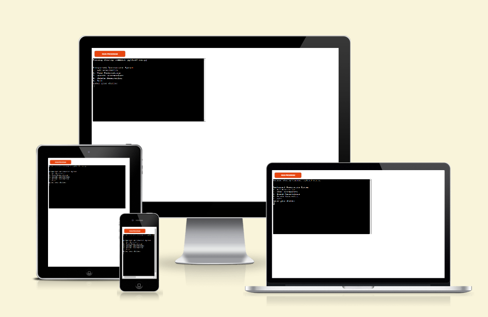

# Restaurant Reservation System

The Restaurant Reservation Manager is a Python - based application that empowers restaurant staff to efficiently handle customer bookings. By centralizing reservation information and automating key processes, it eliminates manual errors and ensures a smooth, organized reservation management experience.

The project can be viewed and tested [here](https://restaurant-reservation-system-13155c939e45.herokuapp.com/).

## Intended Users

This application is tailored for those directly involved in the day to day management of restaurant reservations. This includes:

- **Restaurant Owners:** Who need a clear overview of bookings and table availability.
- **Managers:** Who handle reservation inquiries, changes, and confirmations.
- **Restaurant Staff:** Who interact with customers and need quick access to reservation details.

## Functionality

The Restaurant Reservation Manager interacts with a Google Sheet to store and retrieve reservation data. It utilizes the following libraries:

- **pandas:** For working with DataFrames (tabular data structures) to represent and manipulate reservation information.
- **datetime:** For handling dates and times, ensuring proper formatting and validation.
- **gspread:** For interacting with Google Sheets API to read and write reservation data.
- **google.oauth2.service_account:** For handling authentication and authorization to access the Google Sheet.

### Core Features

1. **Add Reservation:**
   - Prompts the user to enter the following details:
     - Name (ensures unique names)
     - Date (validates for future dates only)
     - Time (validates within operating hours, 8:00 AM to 10:00 PM)
     - Number of Guests (validates for positive numbers)
   - Provides instant error messages until valid data is entered for each field, guiding the user towards successful reservation creation.
   - Appends the new reservation to the DataFrame and saves it to the Google Sheet.

   

2. **View Reservations:**
   - Fetches all reservations from the Google Sheet.
   - Sorts reservations by date and time in ascending order.
   - Presents the reservations in a clear, tabular format, including an index for easy reference.

   

3. **Search Reservations:**
   - Prompts the user to enter a name to search for.
   - Filters reservations based on the entered name (case-insensitive).
   - Displays matching reservations in a tabular format.

   

4. **Delete Reservation:**
   - Displays all existing reservations.
   - Prompts the user to enter the name of the reservation to delete.
   - Deletes matching reservations from the DataFrame and saves the changes to the Google Sheet.
   - Provides feedback on the number of deleted reservations.

   

5. **Exit:**
   - Gracefully terminates the application, allowing the user to exit the program cleanly.

## Flowcharts

main_menu:

add_reservation:

view_reservation:

search_reservation:

delete_reservation:

## Code Challenges and Solutions

During the development of this application, a few challenges were encountered and addressed:

- **Data Type Consistency**

  The `Date` column in the Google Sheet might be stored as text. To ensure consistent handling, the code explicitly converts it to datetime format when reading and writing data.

- **Duplicate Reservations:**

  An issue with duplicate reservations being saved was resolved by implementing a `clear()` operation on the worksheet before updating it with the latest reservation data. This ensures that the sheet is refreshed with the current state of the reservations, preventing any lingering duplicates.

## Real - Time Validation

The application incorporates real - time validation to enhance data integrity and user experience:

- **Date Validation:** Prevents the entry of past dates, ensuring that reservations are always for future events.
  - *Date formats:* If the user is asked to enter a date in the format "DD-MM-YYYY" and they type "12/31/2023" instead, that's an invalid format.
- **Time Validation:** Restricts reservation times to within the restaurant's operating hours (8:00 AM to 10:00 PM).
  - *Time formats:* Similarly, if the expected time format is "HH:MM" and the user enters "12:30 PM", that would be incorrect.
- **Name Uniqueness:** Ensures that each reservation has a unique name, avoiding confusion and potential conflicts.
- **Non - positive guest counts:** The application expects a positive number of guests for a reservation. If the user enters 0 or a negative number, that's an error.
- **Instant Feedback:** Provides immediate error messages as the user inputs data, prompting for corrections without having to complete the entire form.

## Reservation Sorting

Reservations are presented to the user in a sorted manner, making it easy to identify upcoming bookings:

- **Primary Sort:** By `Date` in ascending order, placing the nearest reservations at the top.
- **Secondary Sort:** By `Time` in ascending order, further organizing reservations within the same date.

## Testing

### PEP8 Validation

Code quality was ensured through validation against PEP8 standards using the [PEP8 CI Linter](https://pep8ci.herokuapp.com/#).

### Manual Testing

The following tests were performed to ensure the correctness and robustness of the Restaurant Reservation Manager:

- **Add Reservation**
  - **Valid Input:**
  Tested with various valid names, dates, times, and guest counts. Verified that reservations were added successfully to the Google Sheet.
  - **Invalid Input:**
    - **Duplicate Names:** Attempted to add reservations with existing names. Confirmed that appropriate error messages were displayed and duplicate entries were prevented.
    - **Past Dates:** Entered past dates for reservations. Verified that the system rejected these entries with clear error messages.
    - **Invalid Times:** Inputted times outside the operating hours (8:00 AM - 10:00 PM). Ensured the system displayed relevant error messages.
    - **Non-Positive Guest Counts:** Tried to add reservations with zero or negative guest counts. Confirmed that the system handled these cases with appropriate error messages.
    - **Invalid Formats:** Entered dates and times in incorrect formats. Verified that the system displayed clear error messages guiding the user to enter data in the correct format.

- **View Reservations**
  - **Empty Sheet:** Tested with an empty Google Sheet. Confirmed that the system displayed the "No reservations found" message.
  - **Existing Reservations:** Added multiple reservations and verified that the `view_reservations` function displayed them correctly, sorted by date and time in ascending order.

- **Search Reservations**
  - **Existing Reservation:** Searched for a reservation using a name that exists in the Google Sheet. Confirmed that the system displayed the matching reservation details.
  - **Non-existent Reservation:** Searched for a reservation using a name that does not exist. Verified that the system displayed the "No reservations found matching the criteria" message.
  - **Partial Name Match:** Searched using a part of a reservation name. Ensured the system displayed all reservations containing the search term (case-insensitive).

- **Delete Reservation**
  - **Existing Reservation:**  Selected an existing reservation for deletion. Confirmed that the reservation was successfully removed from the Google Sheet and the system displayed a confirmation message.
  - **Non-existent Reservation:** Attempted to delete a reservation with a name that doesn't exist. Verified that the system displayed the "No reservations found matching the criteria" message.

- **Exit**
  - **Menu Option 5:** Selected the "Exit" option from the main menu. Confirmed that the application terminated gracefully without any errors.

## Deployment

### Google Sheets Integration

- Prerequisites:

  - An active Google account.
  - A Google Sheets spreadsheet named "ReservationManager".

### API Activation

- Go to the Google API Library (console.developers.google.com).
- Create a new project.
- Enable the "Google Sheets API".
- In the "APIs and services" section, go to "Credentials" and create new credentials.
- Choose "Service Account", and give it a name.
- Assign the service account the role "Project > Editor".
- Generate a key in "JSON" format. Download the JSON file containing your service account credentials.
- Store this JSON file securely.
- Share your Google Sheet with the service account's email (found in the JSON file).

### GitHub

- Add creds.json to your .gitignore file.

### Library Installation

- `pip install -r requirements.txt`
- `pip install pandas`
- `pip install gspread google-auth`

### Client Setup

- Place the downloaded JSON key file in your project's root directory.
- Rename it to `creds.json`

### Heroku

- Generate `requirements.txt`:

 `pip3 freeze > requirements.txt`

### Heroku Account & App Creation

- Create a Heroku account if you don't have one.
- Log in and create a new Heroku app.

**Configuration Variables:**

- In your Heroku app settings, go to "Config Vars".
- Add CREDS with the contents of your creds.json file.
- Add PORT with the value 8000.

**Buildpacks:**

- Add Python and Node.js buildpacks.

### Heroku Deployment

- Connect your GitHub repository to Heroku.
- Automatic / Manual deploys (optional).
- Click "Deploy Branch".

### Specific Installations for This Code

- `gspread`: Interacts with Google Sheets.
- `google-auth`: Handles Google API authentication.
- `pandas`: Data analysis and manipulation.

## Potential Future Enhancements

The Restaurant Reservation Manager, while functional in its current state, holds potential for further improvements and feature additions to enhance its capabilities and user experience:

- **Maximum Capacity Management:** Implement a feature to set the maximum capacity of the restaurant. This would allow the system to automatically restrict the number of reservations that can be made at any given time, preventing overbooking and ensuring a comfortable dining experience for all guests.

- **Visual Calendar View:** Integrate a visual calendar interface to display reservations in a more intuitive and user-friendly manner. This would enable staff to quickly see available time slots and make informed decisions when accepting new bookings or managing existing ones.

- **Integration with External Systems:** Explore the possibility of integrating the reservation manager with other restaurant management systems, such as point-of-sale (POS) systems or customer relationship management (CRM) tools. This would enable seamless data sharing and streamline various operational processes.

- **Edit Reservations:** Introduce an "Edit Reservations" feature that allows users to modify existing bookings. This would provide greater flexibility for accommodating changes in guest numbers, preferred dining times, or other reservation details.

These enhancements would further elevate the Restaurant Reservation Manager's functionality, providing a more comprehensive and adaptable solution for managing restaurant reservations.

## Technology Used

- **Python**: A programming language used to implement the core logic of the application.
- **Heroku**: A cloud platform that enables easy deployment and hosting of the application.
- **Lucidchart**: A diagramming tool used to create visual representations of the application's architecture and workflows.
- **CI Python Linter**: A continuous integration tool that automatically checks the Python code for style and potential errors.
- **Black (vercel app)**: A code formatter that ensures consistent code style across the project.
